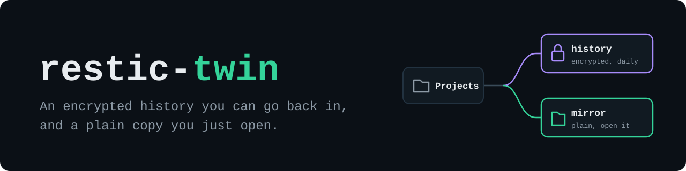

<p align="center">
  
</p>

<h1 align="center">restic-twin</h1>

<p align="center"><strong>Your projects folder, backed up every day to a second drive: an encrypted restic history you can go back in, and a plain copy you open in Explorer or Finder.</strong></p>

<p align="center">
  <a href="#install">Install</a> ·
  <a href="#macos-beta">macOS (beta)</a> ·
  <a href="#how-a-day-goes">How a day goes</a> ·
  <a href="docs/configuration.md">Configuration</a> ·
  <a href="docs/restore.md">Restore</a> ·
  <a href="docs/troubleshooting.md">Troubleshooting</a> ·
  <a href="README.pt-BR.md">Português do Brasil</a>
</p>

<p align="center">
  <a href="https://github.com/thalesholleben/restic-twin/actions/workflows/ci.yml"></a>
  <a href="LICENSE"></a>
  <a href="#requirements"></a>
  <a href="#macos-beta"></a>
  <a href="#requirements"></a>
  <a href="scripts/install-restic.ps1"></a>
</p>

## The problem

A second drive in the PC is the cheapest backup there is, and most people use it by copying folders
over by hand now and then. That copy is always a little old, and it holds one version of each file:
overwrite something on Monday, notice on Wednesday, and the good version is gone from both drives.

[restic](https://restic.net) solves the history part, with encrypted and deduplicated snapshots, one a
day, for very little extra space. But you cannot open a restic repository in Explorer, and running it
every day on Windows as a service, through VSS, with retention, logs and a failure you can actually
see, is a weekend of scripting that is easy to get subtly wrong.

restic-twin is that weekend, done and tested. It started as the backup of one developer's workspace,
run every day since mid-2026, and the public version fixes what that daily use turned up, listed in
[what daily use found](#what-daily-use-found). It runs on Windows, and in beta on macOS.

## What you get

On the second drive, under the folder you choose:

```
E:\restic-twin\
  mirror\        a plain copy of the latest backup: open it, search it, copy from it
  history\       the encrypted restic repository, one snapshot per day
  reports\2026\09\
    changes_2026-09-23_190002_c067aab9.md     what changed since yesterday, to read
    changes_2026-09-23_190002_c067aab9.csv    the same, for a spreadsheet
    changes_2026-09-23_190002_c067aab9.jsonl  everything restic reported, for scripts
  logs\          latest.json, runs.jsonl and one set of logs per run
  recovery\      the repository password and a README on how to restore anywhere
  hot-copies\    frequent copies of the few files you list, if any
  restores\      where restore.ps1 puts what you bring back
```

## How a day goes

<p align="center">
  
</p>

1. At 19:00 the daily task starts, as SYSTEM. If the PC was off, it runs at the next start.
2. restic takes a snapshot of the source through VSS, so files that other programs hold open are
   read as they were at one instant.
3. restic compares it with the previous snapshot, and the change report is written.
4. Only then robocopy refreshes the mirror. A file you deleted by mistake today disappears from the
   mirror too, but it is still in yesterday's snapshot.
5. Retention keeps one snapshot for each of the last 7 days and one for each of the last 6 months.
   Once a week restic also prunes unused data and checks the repository.

On a Mac the same day runs under launchd, as root, with rsync for the mirror and without VSS, and a
Mac that was off at 19:00 catches up within the hour after it starts. See [macOS](#macos-beta).

Hot copies are for the two or three files that change all day, like a notes file or a board, where
one copy a day is not enough. Every 5 minutes, while you are signed in, each set of files you listed
is copied as a whole into a timestamped folder, but only when one of them changed, and only the
last 12 versions stay. They are plain files, no restore needed.

## Install

### Requirements

- Windows 10 or 11, and a second drive (internal, USB or anything with a drive letter).
- PowerShell 7 is recommended; Windows PowerShell 5.1, which every Windows ships with, works too.
- Administrator rights for the install: the daily task runs as SYSTEM and uses VSS.

restic itself is downloaded by the installer from its official GitHub release and checked against a
checksum pinned in [install-restic.ps1](scripts/install-restic.ps1). Nothing else is needed.

### Steps

```powershell
git clone https://github.com/thalesholleben/restic-twin.git
cd restic-twin
Copy-Item config\settings.example.psd1 config\settings.psd1
notepad config\settings.psd1    # set SourcePath and DestinationRoot, save
```

Then, in PowerShell opened as Administrator, in the same folder:

```powershell
Set-ExecutionPolicy -Scope Process -ExecutionPolicy Bypass
.\scripts\install.ps1
```

The installer creates the destination folders, a random repository password and the restic
repository. No other local account can read those folders, and yours can read but not change what
the daily task writes. It then copies itself to `C:\Program Files\restic-twin` and registers the
tasks there. It warns you if the source and the destination sit on the same physical disk.

**Copy the password now.** It is in `recovery\restic-password.txt` under your destination. Put it in
a password manager: without it nobody can decrypt the history, including you.

Run the first backup instead of waiting for 19:00:

```powershell
Start-ScheduledTask -TaskName 'restic-twin daily backup'
```

### macOS (beta)

The same scripts run on a Mac, Apple silicon or Intel. launchd runs the daily backup as root the way
the Task Scheduler runs it as SYSTEM, rsync refreshes the mirror, and the folders root writes belong
to root, mode 700, with one entry that lets your account read them. Beta means it passes the same
tests on a GitHub macOS runner, including a real install as root on a drive mounted in `/Volumes`,
but it has not been through daily use on a Mac yet. [Tell us](https://github.com/thalesholleben/restic-twin/issues)
what you find.

You need:

- PowerShell 7 installed for the whole Mac, `brew install --cask powershell` or the `.pkg` from the
  [PowerShell releases](https://github.com/PowerShell/PowerShell/releases). The daily job runs it as
  root, so it has to be the copy in `/usr/local/microsoft/powershell/7`, which only root can change.
- A backup drive formatted APFS or Mac OS Extended, with "Ignore ownership on this volume" off in its
  Get Info window. On exFAT it works, but nothing on it stays private.
- Full Disk Access for that PowerShell if the source is in Desktop, Documents or Downloads, or if
  macOS refuses the job the backup drive: see
  [troubleshooting](docs/troubleshooting.md#operation-not-permitted-on-macos). A source elsewhere,
  like `~/Projects`, needs nothing.

```sh
git clone https://github.com/thalesholleben/restic-twin.git
cd restic-twin
cp config/settings.example.macos.psd1 config/settings.psd1
nano config/settings.psd1      # set SourcePath and DestinationRoot, save
sudo pwsh ./scripts/install.ps1
sudo launchctl kickstart system/com.restic-twin.daily      # the first backup, now
```

The installer does what it does on Windows, with `/Library/Application Support/restic-twin` as the
installed copy. The daily job runs at `DailyAt` and also every hour with `-IfDue`, which backs up
only when nothing succeeded since the last `DailyAt`: launchd does not run a job it missed while the
Mac was off. The password is in `recovery/restic-password.txt`, readable by you: copy it now.

## Everyday use

| You want to | Run |
|---|---|
| See the last run, the next one and anything that needs you | `.\scripts\status.ps1` |
| Back up right now, elevated | `& "$env:ProgramFiles\restic-twin\scripts\backup.ps1"` |
| Bring back the latest snapshot into a new folder | `.\scripts\restore.ps1` |
| Bring back one folder from an older snapshot | `.\scripts\restore.ps1 -Snapshot 4bd2e9a1 -Include '/docs'` |
| Change a setting | edit `config\settings.psd1`, then run `.\scripts\install.ps1` again, elevated |
| Remove the tasks and the installed copy, keeping every backup | `.\scripts\uninstall.ps1`, elevated |

On macOS the same scripts run with `pwsh ./scripts/status.ps1` and `pwsh ./scripts/restore.ps1`, and
with `sudo` where the table says elevated: `sudo pwsh ./scripts/install.ps1`, `sudo pwsh
./scripts/uninstall.ps1`, and a backup right now with `sudo pwsh '/Library/Application
Support/restic-twin/scripts/backup.ps1'`.

For yesterday's version of a file, the mirror has today's and the history has the rest; see
[restore](docs/restore.md). `status.ps1` also tells you when the tasks still run an older copy of
your settings.

## A change report

Every run after the first writes one, in three formats. The Markdown one reads like this:

```markdown
# Changes in backup 2026-09-23_190002

- Previous snapshot: `8f1c2d3e...`
- Current snapshot: `c067aab9...`
- Changed paths: 42
- Added to the snapshot: 3.1 MB

## By action

- modified: 31
- added: 9
- removed: 2
```

It goes on with the areas and the extensions that changed most, and the first 100 paths. The CSV has
one row per path, and the JSONL keeps every line restic printed. A full sample is in
[docs/examples](docs/examples/change-report.md).

## Safety rails

- **The mirror refresh never runs into a folder it did not create.** robocopy `/MIR` and rsync
  `--delete` delete whatever the destination has and the source does not, so the mirror folder has
  to be empty, or carry the marker restic-twin wrote there naming this very source.
- **The history is written before the mirror**, so a deletion is always still in the previous
  snapshot when the mirror loses it.
- **Restores go to a new folder**, never over an existing one and never inside the source.
- **The installer never replaces a password.** When a repository exists and its password file is
  missing, it stops instead of creating a new one that would not open the history.
- **Everything that runs as SYSTEM or root runs from a copy only administrators can change**,
  Program Files on Windows and `/Library/Application Support` on macOS, through a PowerShell only
  they can replace. A script in your profile that SYSTEM runs every night would hand SYSTEM to
  anything running as you.
- **What SYSTEM or root writes, your account can only read.** The history, the mirror, the reports
  and the logs belong to Administrators (to root, on macOS) once the jobs are installed. Nothing
  running as you, ransomware included, can delete or encrypt them, swap a file the daily job reads
  back, or redirect its writes with a junction or a link. You still open, search and copy from all
  of it, and you keep full control of the hot copies and the restores.
- **A run that could not read a file fails, and names it**, instead of reporting success with a
  hole in the snapshot. The fix is one line in the exclude list or a permission change.
- **Settings are checked before anything runs**: a source inside the destination, a password inside
  the mirror, a misspelled key or a file listed twice all stop with a message that says what to fix.

## What daily use found

The personal version ran for three months before this one. Its logs, and porting it, turned up these,
all fixed and covered by tests here:

| What went wrong | How it showed | What restic-twin does |
|---|---|---|
| Every accented path in the change reports came out garbled | Folder names in the CSV looked like mojibake | Switches the console to UTF-8 before calling restic: a scheduled task runs on the OEM code page |
| "Retry 3 times every 15 minutes" never retried | Twelve failed runs, each followed by the next day's run | Says so: Task Scheduler restarts a task that fails to start, not one that exits with 1 |
| A manual run and the scheduled one could overlap | Found reading the code | The run lock is `Global\`: the scheduled run lives in another session |
| A name in the exclude list matching a parent folder excluded everything | Found by the tests: a source under `...\build\` had an empty snapshot and exit code 0 | Anchors every exclude pattern under the source, so restic agrees with robocopy |
| Weekly maintenance ran on Sundays only | Found reading the code: a PC that is off on Sundays never prunes | Runs it when the last one is 7 days old |

## Limits

- **It is not offsite.** A second drive protects you from a disk that fails, from your own mistakes
  and from ransomware that runs as you, not from theft, fire or anything that gets administrator
  rights. Copy the history somewhere else with `restic copy`, keep the drive unplugged between
  backups, or both.
- **One source folder per machine.** Put what you protect under one folder.
- **macOS is beta.** It passes the same tests as Windows on a GitHub macOS runner, plus a real
  install as root, and has not been through daily use on a Mac yet. There is no VSS there: a file
  that a program is writing during the backup is read as it is at that moment.
- **Windows and macOS only.** There is no Linux adapter.
- **A file that is always open in exclusive mode**, like a running database or a VM disk, is in the
  snapshot (through VSS) but makes the mirror fail. List its name in `config\excludes-mirror.txt`.

## Roadmap

- An offsite copy of the history with `restic copy`, to a NAS or a cloud bucket.
- A notification when a run fails.
- More than one source folder.

## Documentation

[How it works](docs/how-it-works.md), [configuration](docs/configuration.md),
[restore](docs/restore.md), [troubleshooting](docs/troubleshooting.md), [security](SECURITY.md),
[contributing](CONTRIBUTING.md) and the [changelog](CHANGELOG.md). Coding agents start at
[AGENTS.md](AGENTS.md).

## License

[MIT](LICENSE), by [SyntaxLab](https://syntaxlab.com.br). restic is a separate project under the BSD
2-Clause license; restic-twin downloads the official release and does not redistribute it.
